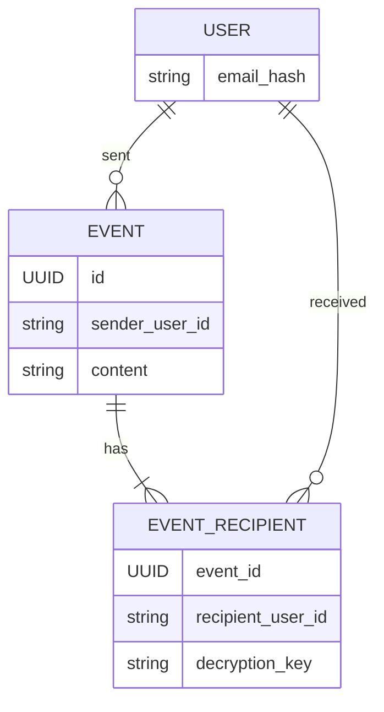
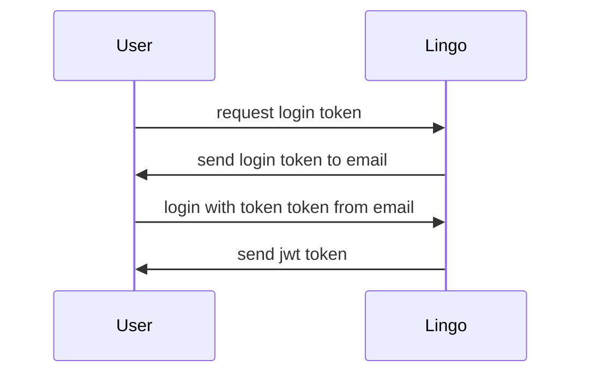
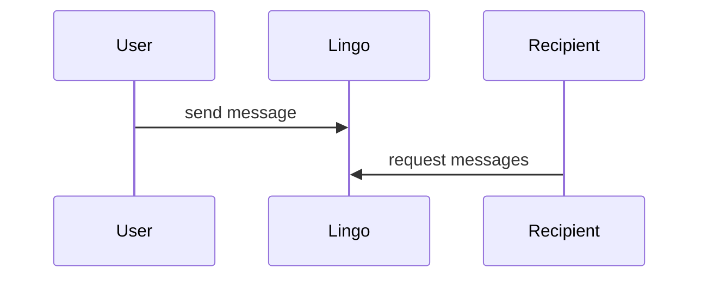

# Lingo
Lingo is a chat application that allows users to chat with each other in real time without having to create an account. Events (messages) are encrypted with a key that is only known to the sender and the recipient. This means that the server can not read the messages that are sent between users.

Having access to an email address also means you can have access to messages sent to you by other users. 
You will be granted a JWT by login in with a token send to your email. 
This JWT will be used to authenticate you when you want to send or receive messages.

An address of a user is the sha256 hash of the email address of the user. Email address hashes are used to protect the privacy of users, although 100% privacy is not guaranteed this way and although stored as a hash, a plain text email address is still needed to send a login token to.

protip: use a + in your email address to create a unique email address: its-a-me+askdasd@gmail.com

## domain

A event is a message that is sent from one user to another user. Commonly referred to as a message, but it can also be a notification or something else, like:
- changing the name of a chat
- sending a file

Having an user model gives the following benefits:
- users can be soft deleted
- users can only send events to other users that have an account

## login

## send message
