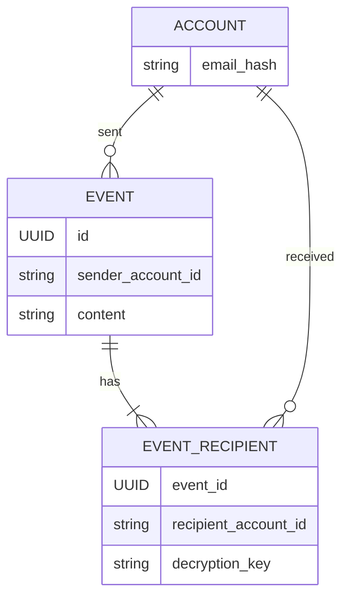
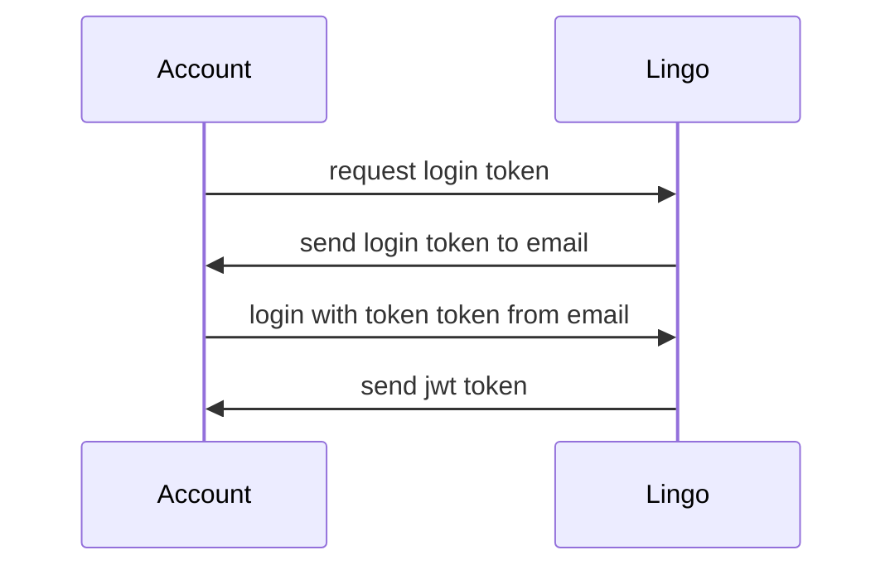
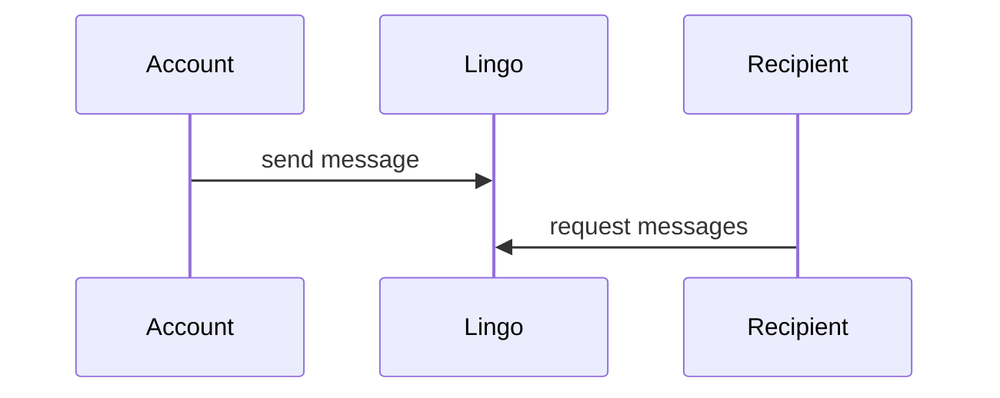

# Lingo
Lingo is a web app. I don't know what it will do, but for now the goals are:
- single binary, many commands with different functionality, like: serving grpc, http and jobs.
- use proto as the main way to design api's
- use proto to generate https gateways for the grpc servers
- add all https service to swagger ui so they can be easily tested

# Setup
- install [docker](https://docs.docker.com/get-docker/).
- install openssl (for generating certificates and keys).
- run `setup.sh`. you should be able to run the setup as many times as you want.
  - Specified deps in the `buf.yaml` need to be covered in your `buf.lock` file. If you get an error, run `scripts/proto-buf-mod-update.sh` to generate the `buf.lock` file.
  - resulting generated files are in the `protogen` folder.
  - check changes with the [buf](https://buf.build/) linter: `scripts/proto-lint.sh`.

# Run
- after setup, run `docker-compose up`
- To view the [open-api](https://en.wikipedia.org/wiki/Open_API) specs for various services, open `localhost:8090` in the browser.

# Develop
The goal is to have a good developer experience. That means that the developer should have to read minimal setup guides en be up and running as fast as possible.

## Linting
- to lint, run `./scripts/lint.sh`

## Testing
- to run all tests, run `go run test ./...`

## Database migrations
- to create a new migration, run `./scripts/new-migration.sh <name of migration>`.
- after you have writen you migration, run `./scripts/hash-migration.sh`.

# danger zone below

## domain

A event is a message that is sent from one account to another account. Commonly referred to as a message, but it can also be a notification or something else, like:
- changing the name of a chat
- sending a file

Having an account model gives the following benefits:
- accounts can be soft deleted
- accounts can only send events to other accounts that have an account

## login

## send message

