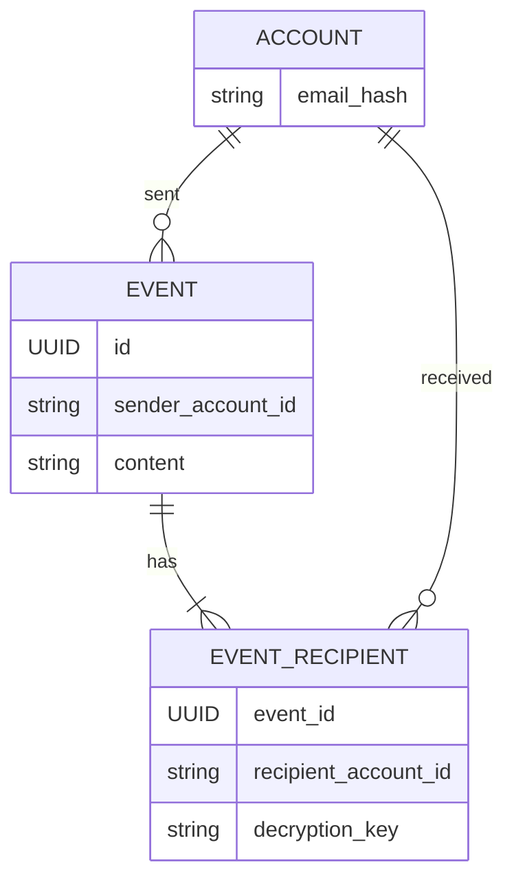
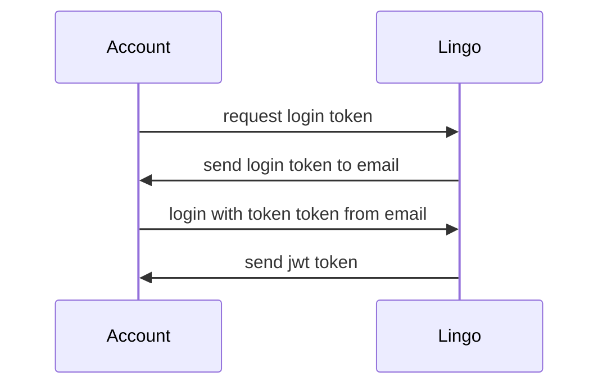
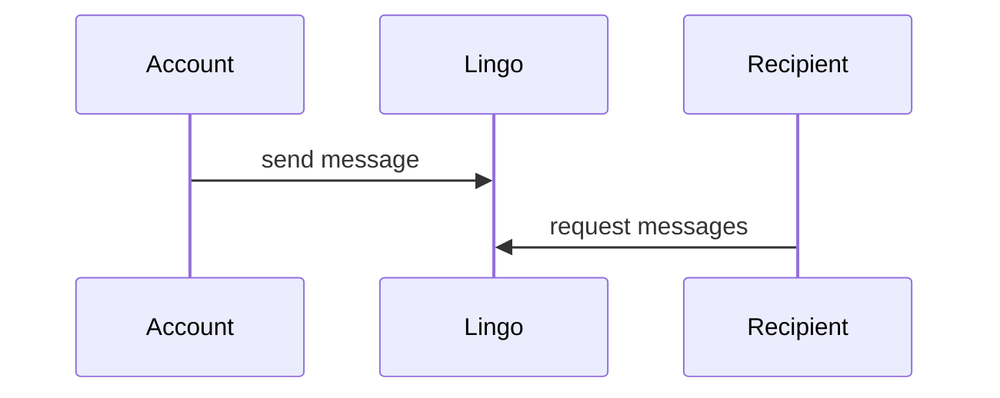

# Lingo
Lingo is a chat application that allows accounts to chat with each other in real time without having to create an account. Events (messages) are encrypted with a key that is only known to the sender and the recipient. This means that the server can not read the messages that are sent between accounts.

Having access to an email address also means you can have access to messages sent to you by other accounts. 
You will be granted a JWT by login in with a token send to your email. 
This JWT will be used to authenticate you when you want to send or receive messages.

An address of a account is the sha256 hash of the email address of the account. Email address hashes are used to protect the privacy of accounts, although 100% privacy is not guaranteed this way and although stored as a hash, a plain text email address is still needed to send a login token to.

protip: use a + in your email address to create a unique email address: its-a-me+askdasd@gmail.com

# Setup
- install [docker](https://docs.docker.com/get-docker/).
- install openssl (for generating certificates and keys).
- run `setup.sh`. you should be able to run the setup as many times as you want.
  - Specified deps in the `buf.yaml` need to be covered in your `buf.lock` file. If you get an error, run `scripts/proto-buf-mod-update.sh` to generate the `buf.lock` file.
  - resulting generated files are in the `protogen` folder.
  - check changes with the [buf](https://buf.build/) linter: `scripts/proto-lint.sh`.

# Run
- after setup, run `docker-compose up`
- To view the [open-api](https://en.wikipedia.org/wiki/Open_API) specs for various services, open `localhost:8090` in the browser.

# Develop
- to lint, run `./scripts/lint.sh`
- to run all tests, run `go run test ./...`

# Database migrations
- to create a new migration, run `./scripts/new-migration.sh <name of migration>`.
- after you have writen you migration, run `./scripts/hash-migration.sh`.

# danger zone below

## domain

A event is a message that is sent from one account to another account. Commonly referred to as a message, but it can also be a notification or something else, like:
- changing the name of a chat
- sending a file

Having an account model gives the following benefits:
- accounts can be soft deleted
- accounts can only send events to other accounts that have an account

## login

## send message

