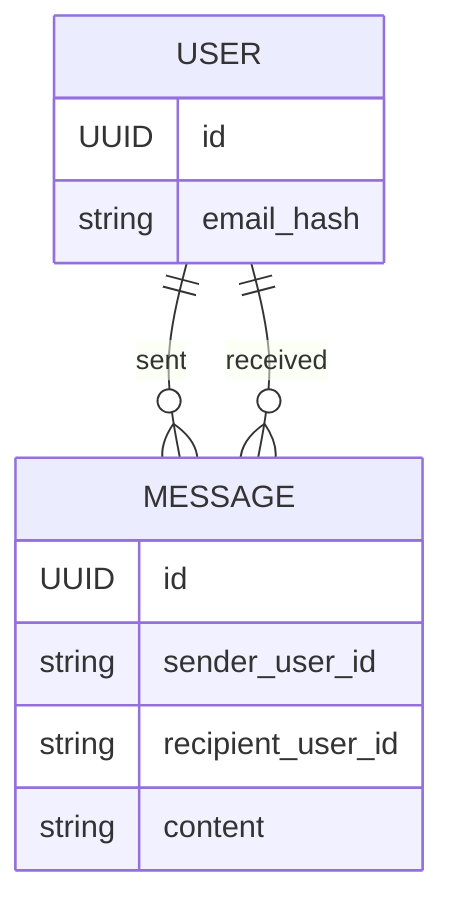
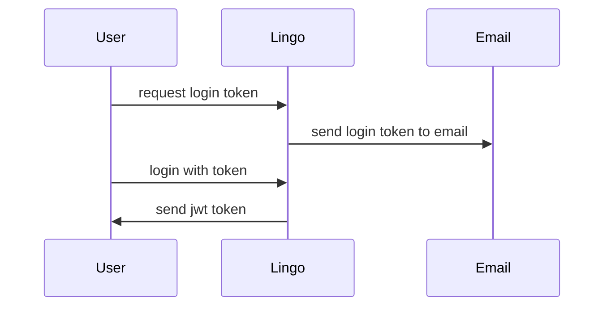

# Lingo
Lingo is a chat application that allows users to chat with each other in real time. 

Having access to an email address also means you can have access to messages sent to you by other users. 
You will be granted a JWT by login in with a token send to your email. 
This JWT will be used to authenticate you when you want to send or receive messages.

An address of a user is the sha256 hash of the email address of the user. Email address hashes
are used to protect the privacy of users, although 100% privacy is not guaranteed this way.
Although stored as a hash, a plain text email address is still needed to send a login token to.

protip: use a + in your email address to create a unique email address: its-a-me+askdasd@gmail.com

## domain

## login

## send message
